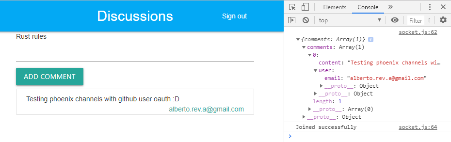

# Starting Phoenix server:

* Install dependencies with:

      `mix deps.get`

* Create and migrate your database with:

      `mix ecto.create && mix ecto.migrate`

* Start Phoenix endpoint with:

      `mix phx.server`

Now you can visit [`localhost:4000`](http://localhost:4000) from your browser.

# The-Complete-Elixir-and-Phoenix-Bootcamp

Proyect accomplished following: The Complete Elixir and Phoenix Bootcamp from udemy.

The purpose of this repository is to acquire the knowledge of Phoenix framework. Followed specifically to get a grasp of channels interaction.

## Prerequisites

  * To run this project you need:
    * Erlang: The programming language http://www.erlang.org/
    * Elixir: The programming language https://elixir-lang.org/

## Built within

* Elixir: The programming language https://elixir-lang.org/
* Phoenix: Web framework in Elixir http://www.phoenixframework.org/

## Authors

* **Stephen Grider** - *initial work* [StephenGrider](https://github.com/StephenGrider)
* **Alberto Revuelta Arribas** - *continued work* [kamigari](https://github.com/kamigari)

## License

* This project is licensed under the License - see the [LICENSE.md](LICENSE.md) file for details.
